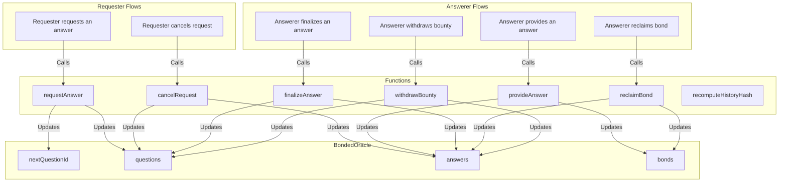

## BondedOracle

The `BondedOracle` contract is a decentralized oracle system that leverages economic incentives to ensure the reliability and security of the answers provided. The contract operates on principles of game theory to align the interests of participants with the goal of providing accurate and trustworthy information.

### Economic Game Theory

1. **Bounty and Bond Mechanism**:
   - **Bounty**: Users who request answers must provide a bounty, which serves as a reward for the correct answer. This creates a financial incentive for participants to provide accurate answers.
   - **Bond**: Participants who provide answers must stake a bond. This bond is at risk if their answer is not accepted, creating a disincentive for providing false or low-quality answers.

2. **Incentive Alignment**:
   - **High Stakes for Accuracy**: The requirement to stake a bond ensures that only participants who are confident in their answers will participate. The potential loss of the bond discourages malicious behavior.
   - **Reward for Correct Answers**: The bounty is awarded to the participant whose answer is finalized, providing a direct financial reward for accuracy.

3. **Security Properties**:
   - **Economic Security**: The combination of bounties and bonds creates a self-regulating system where the cost of providing false information outweighs the potential benefits.
   - **Extended Answer Period**: If answers are provided close to the expiry time, the period is extended, ensuring that last-minute answers are still subject to scrutiny.

4. **Intersubjectivity**:
   - **Collective Agreement**: The mechanism relies on the collective agreement of participants to determine the correct answer. This intersubjective approach ensures that the final answer reflects a consensus, reducing the likelihood of biased or incorrect information.

### Potential Use Cases

1. **Prediction Markets**:
   - Users can request answers to questions about future events, such as election outcomes or sports results. The economic incentives ensure that participants provide accurate predictions.

2. **Dispute Resolution**:
   - Community-driven resolution of disputes can be facilitated by the oracle. Users can request answers to questions related to the dispute, and the economic incentives ensure that the community provides fair and accurate resolutions.

### TLDR

The `BondedOracle` contract leverages economic game theory and intersubjectivity to create a decentralized system for providing reliable answers. By aligning the financial incentives of participants with the goal of accuracy, and relying on collective agreement, the contract ensures that the information provided is both trustworthy and secure. This makes it suitable for a wide range of applications, from prediction markets to data verification and dispute resolution.



### Build

To build the project, run:

```shell
forge build
```

### Test

```shell
forge test
```
